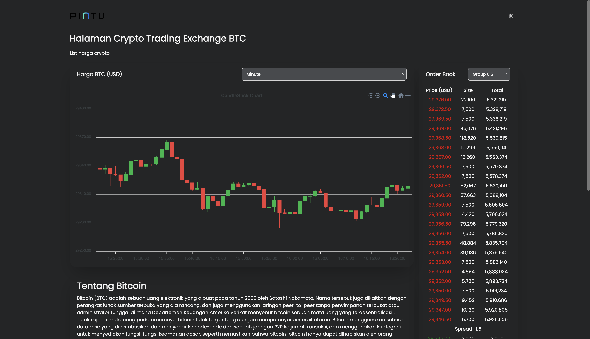
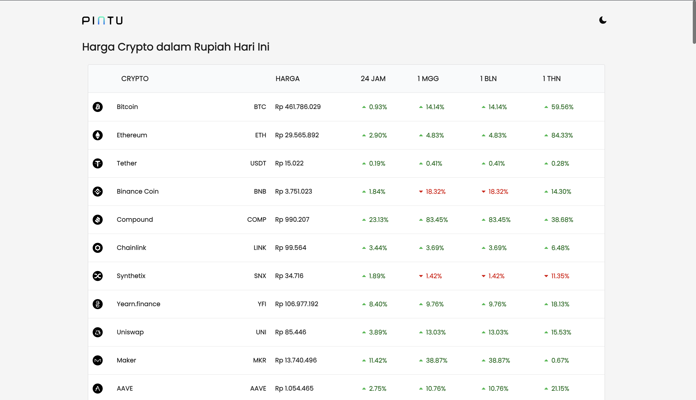
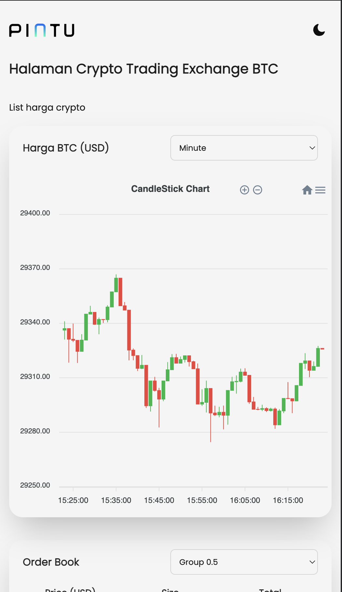
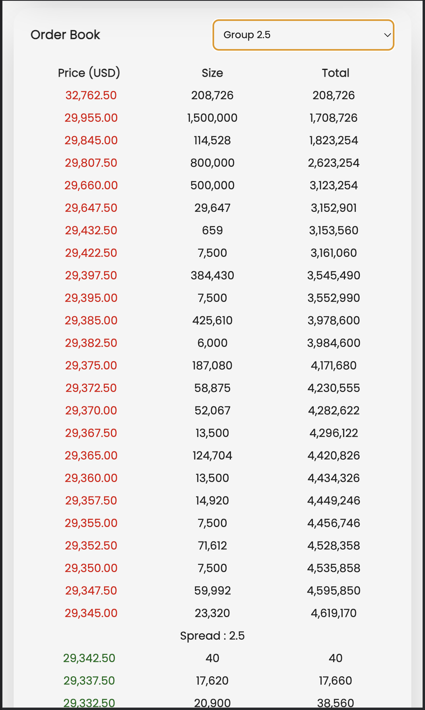

# crypto-trading
crypto-trading is a frontend mockup website that hava a crypto trading exchange page (order book section and candlestick chart) page and market list page. You can access the website on https://crypto-trading-six.vercel.app. This app is designed with Next and Typescript, while deployed in vercel with auto deployment.



Pages and functions on the app :
- Crypto Trading Exchange page
  - CandleStick Chart that can show BTC historical data by minutes, hours, or days
  - Order book section that shows asks and bids of BTC USD that can be grouped by 0.5, 1, and 2.5
  - Some description of BTC for better UI
  - Data for historical data is from https://min-api.cryptocompare.com because Google Finance API is only for spreadsheet and the API has been shutdown permanently. To get the historical data I create an backend app (https://pintu-app.vercel.app) where it become a proxy so I can get the data. 
  - Data for order book is from ``wss://www.cryptofacilities.com/ws/v1`` using websocket
- List Market page
  - List of token to show prices of each token where the data is from API
  - Token can be clicked to redirect to exchange page
- Each page is already responsive to desktop and mobile, with dark mode
- you can find other functions in the [app](https://crypto-trading-six.vercel.app)

## How to run the code

1. Clone this repository `git@github.com:JovanKaruna/crypto-trading.git`
2. In the root project directory, run `yarn install` to install all the dependencies
3. Copy the `.env.example` file into `.env` file in the root project directory and then change the `"YOUR API END POINT GOES HERE"` with your API end point (we will use `https://pintu-app.vercel.app`)
```
REACT_APP_API_END_POINT=https://pintu-app.vercel.app
```
4. Then run `yarn dev` to run and compile the code, then you can open the ``http://localhost:3000`` in your web browser

## Dependencies
Some of the dependencies that are used in this project and why I used it
```
- Next: React framework as it is a requirement of the project
- Websocket : to do websocket which is also a requirement of the project
- Typescript : more maintainable than javascript
- ESLint : to format codes
- Axios : to fetch API
- Tailwind : as CSS framework to make coding easier
- React Apexcharts : for creating charts
- semantic ui react : for built in component, used only on list market page
```

## Screenshots




## Contributors
This project is created by :
[Jovan Karuna Cahyadi](https://www.linkedin.com/in/jovan-karuna-cahyadi/).